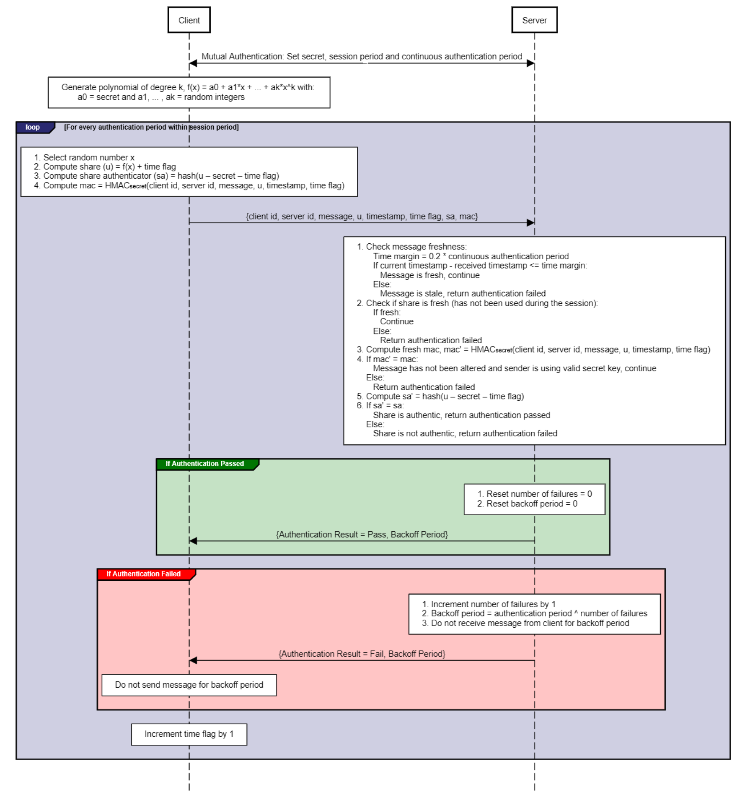

# Secret Sharing based Continuous Authentication Algorithm

## 1. Client-side Functions

### 1.1 Polynomial Generator (secret, degree k)
Generates a polynomial of degree **k**, defined as:  
**f(x) = a0 + a1*x + a2*x² + ... + ak*x^k**, returning an array **a = [a0, a1, …, ak]**, where:
- **a0 = secret**
- **a1, a2, …, ak** = randomly sampled integers between (1, 100)

### 1.2 Share Generator (secret, a, x, time flag)
Generates a **time-bound share** and **share authenticator** for a random **x**:
- **share (u) = f(x) + time flag**
- **share authenticator (sa) = hash (share – secret – time flag)**

The **time flag** starts at **1** and increments with each continuous authentication.

### 1.3 Message Generator (secret, server id, client id, message, share, timestamp, time flag, share authenticator)
Constructs the message:
- **mac = HMACsecret (client id, server id, message, share, timestamp, time flag)**
- **Message to send = {client id, server id, message, share, timestamp, time flag, share authenticator, mac}**

---

## 2. Server-side Functions

### 2.1 Authenticator (secret, received shares, message received, time margin)
#### **Check message freshness**
- **Time margin = authentication period × 0.2**
- If **current timestamp – received timestamp ≤ time margin** → **Message is fresh**
- Else → **Message is stale → Authentication failed**

#### **Check Share Freshness**  
Ensures the share **has not been used before** in the session.

#### **Compute fresh MAC and check data integrity**
- **mac = HMACsecret (client id, server id, message, share, timestamp, time flag)**
- If **mac = received mac** → **Message is unaltered & sender has valid secret**
- Else → **Authentication failed**

#### **Check if share is authentic**
- Compute **new share authenticator** using the **received share** and **known secret**:  
  **share authenticator = hash (received share – secret – received time flag)**
- If **share authenticator = received share authenticator** → **Share is authentic → Authentication Pass**
- Else → **Authentication Failed**

---

## 3. Algorithm

### **Initialization**
- **Secret, authentication period, and total session period** are initialized and communicated between **client and server**.

### **During session (for each authentication period):**

#### **Client Side: Message Generation**
1. Generate polynomial:  
   **a = Polynomial Generator (secret, degree)**
2. Select a **random integer x**
3. Compute share:  
   **share, share authenticator = Share Generator (secret, a, x, time flag)**
4. Construct message:  
   **Message to send = Message Generator (secret, server id, client id, message, share, timestamp, time flag, share authenticator)**
5. Send:  
   **{client id, server id, message, share, timestamp, time flag, share authenticator, mac}**
6. Increment **time flag** by **1**.

#### **Server Side: Message Authentication**
1. Receive message:  
   **{client id, server id, message, share, timestamp, time flag, share authenticator, mac}**
2. Authenticate message:  
   **Authentication result = Authenticator (secret, received share, message received, time margin)**
3. If **Authentication Pass**:
   - Reset **number of failures = 0**
   - Reset **backoff period = 0**
   - Send **{Authentication Result, Backoff Period}** to client
4. If **Authentication Fail**:
   - Increment **number of failures** by **1**
   - Compute **backoff period = authentication period ^ number of failures**
   - Send **{Authentication Result, Backoff Period}** to client
   - **Reject client messages** during backoff period.

#### **Client Side: Backoff in Case of Authentication Failure**
- If **Authentication Fail** → **Do not send messages for backoff period.**
